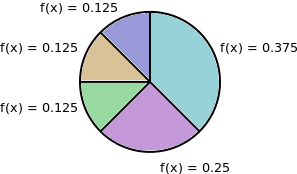
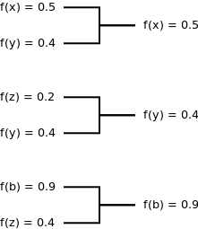

title: Genetic Algorithms
author:
  name: "Alexander D Brown (adb9)"
output: genetic-algorithms.html
controls: true
layout: template/layout.mustache
style: template/ga.css

--

# Genetic Algorithms
## SEM6120 Assignment 1

--

### What is a genetic algorithm?

* [Example](http://boxcar2d.com/)
* More formally:
  * A form of evolutionary algorithm.
  * Focus on search optimisation.
  * Biologically inspired.

--

### How does a genetic algorithm work?

At a glance:

* Solutions are represented as **chromosomes**.
* An initial population of chromosomes is produced.
* Each chromosome is ranked.
* The best chromosomes are picked and carried on to the next **generation**.
* Evolution of new chromosomes.
* Repeat until finished.

--

### Selection

* One of the key parts of a GA.
* To generate good offspring a method of selecting good parents is required.
* Several forms of selection.

--

### Roulette Wheel Selection

* The probability of being chose is proportional to the fitness of the 
  individual.

--

### Tournament Selection

* Population split randomly into pools and the best individual in a   pool is 
  selected.
* Can be optimised for parallel processing.

--

